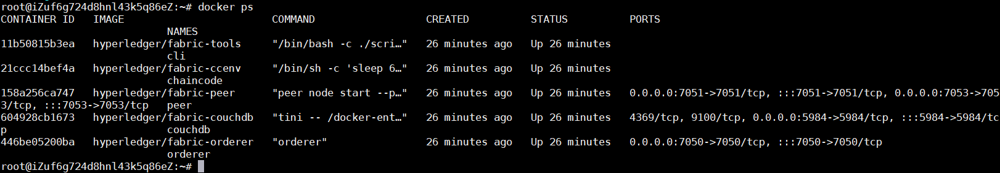
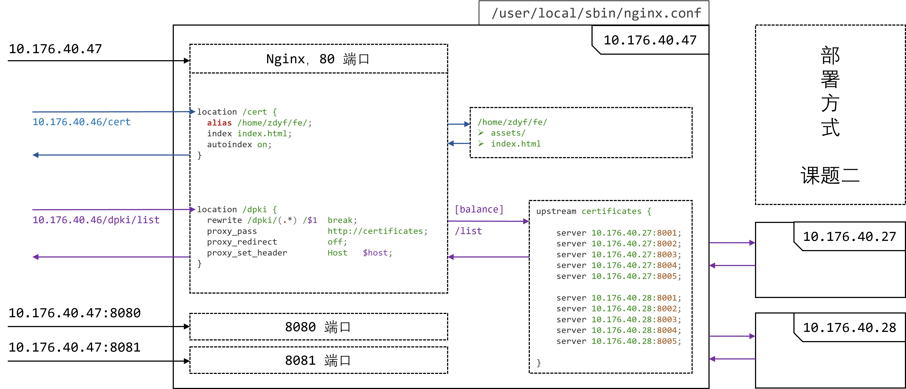

# 重点研发计划-课题二【2019YFB2101702】

课题任务书和相关文档见：`/doc`

本仓库由以下两部分源码组成

1. 后端：`/backend`
2. 前端：`/fe`

## 服务器

- 服务器一：10.176.40.47，密码：`zdyf123!`，sudo：`pcaRKX7Y`
- 服务器二：10.176.40.48，密码：`zdyf123!`，sudo：`39YwW8xh`

## 部署流程

参考[文档](https://nibgi8ovr7.feishu.cn/docx/VK9Qd8Hu2oVCjuxG32Dcx96Jnse)

### 启动 Fabric 环境

```bash
$ cd /home/fn/go/src/github.com/hyperledger/fabric/scripts/fabric-samples/chaincode-docker-devmode
$ sudo docker-compose -f docker-compose-couch.yaml up -d
```

执行 `docker ps` 可以看到一个ccenv容器、一个cli节点、一个peer节点、一个orderer排序节点和一个couchdb数据库。



若没有全部启动，可以通过 `sudo docker-compose -f docker-compose-couch.yaml down` 停止程序后重新启动。

### 运行合约程序

```bash
$ sudo docker exec -it chaincode bash
$ cd data_share/current/trustPlatform
$ CORE_PEER_ADDRESS=peer:7052 CORE_CHAINCODE_ID_NAME=plat:0 ./trustPlatform
```

新建 Terminal

```bash
$ sudo docker exec -it chaincode bash
$ cd data_share/current/dabe
$ CORE_PEER_ADDRESS=peer:7052 CORE_CHAINCODE_ID_NAME=dabe:0 ./dabe
```

### 安装并实例化合约

新建 Terminal

```bash
$ sudo docker exec -it cli bash
$ peer chaincode install -p chaincodedev/chaincode/data_share/current/dabe -n dabe -v 0
$ peer chaincode instantiate -n dabe -v 0 -c '{"Args":[]}' -C myc
$ peer chaincode install -p chaincodedev/chaincode/data_share/current/trustPlatform -n plat -v 0
$ peer chaincode instantiate -n plat -v 0 -c '{"Args":["true"]}' -C myc
```

注：如果想在关闭终端之后仍保持程序运行，可以在第2、3步创建的终端中使用 <kbd>Ctrl</kbd> + <kbd>P</kbd> + <kbd>Q</kbd> 命令退出容器

### 运行 java 后端

新建 Terminal

```bash
$ cd /home/fn/dataShare/
$ sudo nohup java -jar atp-0.0.1-SNAPSHOT.jar 2>&1 &
```

备注：

新版本：

新建Terminal

```bash
$ cd /home/fn/dataShare-v3/
$ sudo nohup java -jar atp-0.0.1-SNAPSHOT.jar 2>&1 &
```

访问前端 http://10.176.40.47/cert

## 指标测试

**针对指标**：可管理数据源属性>2^16级维度

**步骤**：

新建Terminal

```bash
$ sudo docker exec -it cli bash
$ peer chaincode invoke -n dabe -c '{"Args":["/common/batch","someone","someone:a","5","or","this is a test message"]}' -C myc
```


**说明**：该操作会自动进行加解密操作（自动创建用户、生成属性、加解密）

- Args[0]：用户名
- Args[1]：基本属性名
- Args[2]：访问控制连接符（and 或 or）
- Args[3]：要加密的消息

## 部署架构


