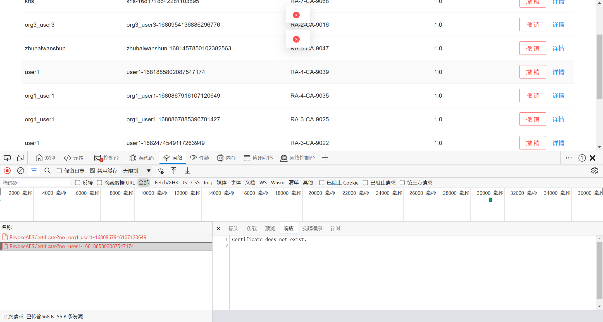

# 待办事项

## 2023-03-14

### 功能问题 

- [ ] 具备CA间信任管理、CA间相互监督； 信任管理？相互监督？如何具体实现？ 

### 指标问题 

- [ ] 支持分布式 CA 中心 ≥ 100个；如何实现？如何展示？
- [ ] 支持证书请求处理并发数 ≥ 10万；如何实现？如何展示？
- [ ] 身份认证平均时间 ≤ 1s

# Bug List

前端：

- [ ] 列表筛选（根据用户？）

后端：

- [ ] UID 是否要去重
- [ ] 列表与数据库表不一致 ？

